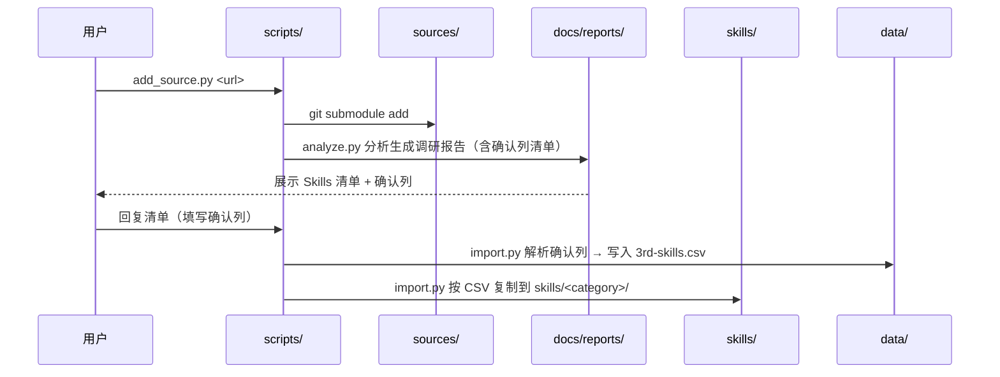
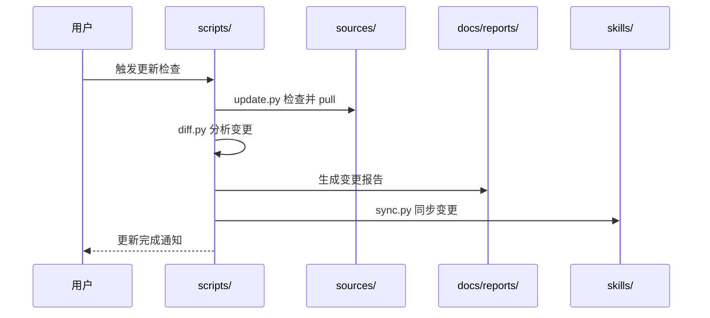
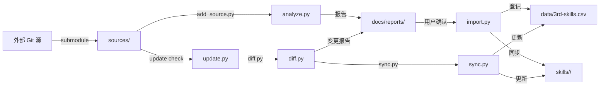

# Skills 仓库设计文档

## Overview

Skills 仓库是一个用于统一管理、引入和更新第三方 skills 的集中式仓库。它为 AI Agent 提供结构化的 skills 分类体系和完整的生命周期管理流程（引入、更新、调研）。

仓库采用分类目录结构，通过 `skills/` 目录供 opencode/Claude Code 扫描，`sources/` 作为第三方源码缓存，`scripts/` 提供自动化能力。

## Architecture

```mermaid
graph TB
    A1[GitHub 仓库 1] -->|add_source.py| B[sources/]
    A2[GitHub 仓库 2] -->|add_source.py| B
    A3[其他 Git 源] -->|add_source.py| B
    B -->|analyze.py| F[docs/reports/]
    F -->|import.py| D[skills/ (6 分类)]
    F -->|import.py| E[data/ (CSV)]
    B -->|update.py| B
    B -->|diff.py| F
    F -->|sync.py| D
    F -->|sync.py| E
    E -.->|maintain_csv.py| C[scripts/]
```

## Modules

| 模块 | 描述 | 链接 |
|------|------|------|
| skills | 分类 skills 目录，opencode 扫描入口 | [skills/](../../skills/) |
| sources | 第三方 git 源码缓存 | [sources/](../../sources/) |
| data | CSV 元数据管理 | [data/](../../data/) |
| scripts | Python 自动化脚本 | [scripts/](../../scripts/) |
| docs | 文档体系 | [docs/](../) |

## 分类体系

### Skills 分类标准

| 分类 | 定位 | 目录 | 示例 |
|------|------|------|------|
| core | 基础工具，不依赖项目上下文 | `skills/core/` | mermaid-diagram, skill-creator |
| engineering | 编码、测试、调试 | `skills/engineering/` | test-driven-development, systematic-debugging |
| planning | 需求分析、方案设计 | `skills/planning/` | brainstorming, writing-plans |
| productivity | 效率提升 | `skills/productivity/` | dispatching-parallel-agents |
| project-mgmt | 项目流程管理 | `skills/project-mgmt/` | project-workflow, project-ci-cd |
| learning | 知识沉淀、上下文构建 | `skills/learning/` | mcu-project-organizer, mcu-qa-assistant |

### Skill 目录结构

```
skills/<category>/<skill-name>/
├── SKILL.md              # 必须，skill 主文件
├── templates/            # 可选，模板文件
├── rules/                # 可选，规则文件
├── scripts/              # 可选，配套脚本
└── evals/                # 可选，评估文件
```

## 工作流设计

### 引入流程



### 确认机制

脚本输出格式（Markdown 表格，用户直接回复修改后的表格）：

```markdown
# Skills 引入清单
| ID | Skill | 描述 | 推荐度 | 建议分类 | 确认 |
|----|-------|------|--------|----------|------|
| 1  | xxx   | ...  | 5      | engineering | ✅ |
| 2  | yyy   | ...  | 3      | productivity | |

用户回复时将确认列标记为 ✅ 或留空跳过，也可修改分类列。
```

### 更新流程



## 技术决策

### 架构选择

- **决策**: 采用 `sources/` submodule 缓存 + `skills/` 分类的分离架构
- **理由**: sources/ 使用 git submodule 保留完整 git 历史，同时 opencode 只扫描 `skills/` 避免干扰
- **替代方案**: 裸 git clone（放弃，无法追踪版本）

### 技术栈

- **脚本语言**: Python 3.9+
- **数据格式**: CSV（脚本维护，不手动编辑）
- **文档格式**: Markdown
- **版本控制**: Git

### CSV Schema 设计

#### sub-repo.csv

| 列名 | 类型 | 说明 |
|------|------|------|
| repo_name | string | 仓库名称（唯一标识） |
| repo_url | string | Git 仓库 URL |
| branch | string | 跟踪分支 |
| last_commit | string | 最后一次拉取的 commit hash |
| added_date | date | 添加日期 |
| status | enum | active/deprecated |

#### 3rd-skills.csv

| 列名 | 类型 | 说明 |
|------|------|------|
| skill_name | string | Skill 名称 |
| category | string | 所属分类 |
| source_repo | string | 来源仓库名称 |
| source_path | string | 在源仓库中的原始路径 |
| imported_date | date | 引入日期 |
| modified | boolean | 是否修改过 |
| last_sync | date | 最后同步日期 |
| priority | int | 冲突时优先级 |

## 数据流



## 安全考虑

- `sources/` 仅拉取可信来源的公开仓库
- 脚本执行前验证仓库签名/commit hash
- CSV 数据通过脚本维护，避免手动编辑引入错误
- 敏感信息（如 token）不入库，通过环境变量传递

## 部署与运行

### 环境要求

| 组件 | 版本 | 说明 |
|------|------|------|
| Python | 3.9+ | 脚本运行环境 |
| Git | 2.0+ | 源码管理 |
| opencode | 最新 | skills 扫描与加载 |

### 脚本执行约束

- 单次分析/同步执行时间 < 30s
- sources/ 仓库数量 < 20 个时保持流畅
- 脚本输出标准化 JSON 供报告生成

## 约束条件

| 约束 | 说明 |
|------|------|
| opencode 扫描路径 | 仅 `skills/` 目录会被扫描 |
| Skill 格式 | 每个 skill 必须包含 `SKILL.md` |
| 兼容性 | 兼容 opencode 和 Claude Code 的 skill 格式 |
